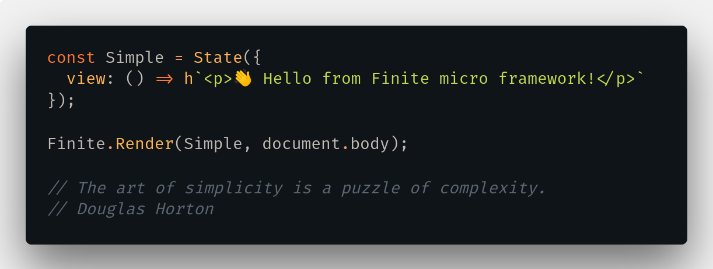

<p align="center">
  
</p>

## How to try ?

Install finite using your package manager

```bash
$ npm install @stepanvanzuriak/finite
```

And just use!

```javascript
import Finite, {State, h} from '@stepanvanzuriak/finite'

const JustText = State({
  view: () => h`<p>Hello!</p>`
});

Finite.Render(JustText, document.body);
```

## Simple counter example

```javascript
const Counter = Finite.State({
  name: "counter",
  transitions: [
    Finite.T("INCREMENT", "counter"),
    Finite.T("DECREMENT", "counter")
  ],
  memory: { count: 0 },
  increment: (_, { count }) =>
    Finite.Transition("INCREMENT", { count: count + 1 }),
  decrement: (_, { count }) =>
    Finite.Transition("INCREMENT", { count: count - 1 }),
  view: ({ count, increment, decrement }) =>
    h`<button on-click=${decrement}>-1</button>
        <div>${count}</div>
        <button on-click=${increment}>+1</button>`
});

Finite.Render(Counter, document.body);
```

## Simple two state example

```javascript
const A = Finite.State({
  name: "A",
  memory: {
    text: "Text A"
  },
  transitions: [Finite.T("MOVE_TO_B", "B")],
  onClick: e => Finite.Transition("MOVE_TO_B"),
  view: ({ text, onClick }) =>
    h`<div>${text}</div><button on-click={${onClick}}>To B</button>`
});

const B = Finite.State({
  name: "B",
  memory: {
    text: "Text B"
  },
  transitions: [Finite.T("MOVE_TO_A", "A")],
  onClick: e => Finite.Transition("MOVE_TO_A", { text: "New Text A" }),
  view: ({ text, onClick }) =>
    h`<div>${text}</div><button on-click={${onClick}}>To A</button>`
});

Finite.Render(A, document.body);
```

##### More examples in `example` folder

## Api

## Finite Namespace

### Types

`TemplateResult` from ['lit-html'](https://github.com/Polymer/lit-html)

```typescript
type ViewFunction = (props: object) => TemplateResult;

interface ITransition {
  name: string;
  to: string;
}

interface IStateType {
  view: ViewFunction;
  name: string;
  memory: object;
  transitions: ITransition[];
  rest: object;
}
```

### State

```typescript
Finite.State({
    view,
    [name],
    [memory],
    [transitions],
    [...rest]
}: IStateType)
```

You can use `rest` for own methods like `onChange, onClick` etc.

### Transition

```typescript
Finite.Transition(
  name : String,
  [payload] : Object
)
```

Change current state to another, `name` is name from state transitions and `payload` is extra data to send

### Render

```typescript
Finite.Render(
  state: State,
  point: HTMLElement
)
```

Set render point and init state for app

### T

```typescript
Finite.T(
  name: String,
  to: String
) -> {name, to}
```
